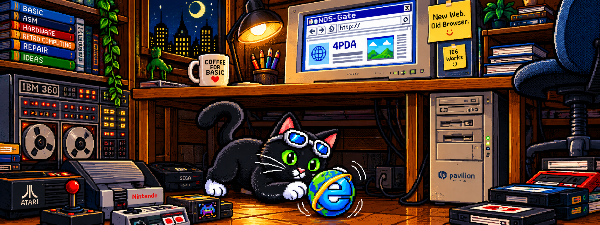

  

[English](#english) | [Русский](#russian)

# NOS-Gate 0.5.1 Preview

**NOS-Gate — New Web. Old Browser.**  
*Because sometimes the browser isn't the problem.*

NOS-Gate is an experimental gateway for old Windows browsers. It sits between a legacy browser and the modern web, fetches pages itself, and returns lighter HTML that old software has a realistic chance of displaying and navigating.

This **0.5.1 Preview** is already usable on many sites, but it is deliberately published as a pre-release: the modern web changes constantly and compatibility is site-dependent.

## What already works

- HTTP/HTTPS fetching handled by NOS-Gate rather than the old browser.
- ORIGINAL, LITE and SUPERLITE page modes.
- Removal of JavaScript in processed modes and simplification of page content.
- Rewriting of ordinary links, forms, images and a number of simple modern constructs for legacy browsers.
- Persistent cookie handling, including authenticated sessions on compatible sites.
- Lightweight search and site-specific compatibility paths.
- Media detection and a Media Bar for recognized media sources.
- YouTube watch/embed URL recognition.
- Up to 8 guarded workers for page/resource loading.
- Release logging is disabled; the logging code remains in the source as no-op functions.

## NOS-Pipe integration — recommended

NOS-Gate works without NOS-Pipe, but installing **NOS-Pipe in its standard location** is recommended if you want online video.

NOS-Gate 0.5.1 first looks for:

`C:\Program Files\NOS-Pipe\NOS-Pipe.jar`

and its MPlayer at:

`C:\Program Files\NOS-Pipe\mplayer.exe`

A neighbouring portable `NOS-Pipe` directory is also supported.

Recognized YouTube links can be handed to NOS-Pipe instead of trying to run the modern YouTube web player inside the old browser. Recognized supported video/media-container sources can also be handed to the external player path.

**NOS-Pipe:** https://github.com/ma-beast/NOS-Pipe

## Tested hardware

The preview has been tested in real use on:

- **HP Pavilion N5445 — Pentium III, Windows XP SP3**
- **HP t5000 — VIA Eden, Windows ME**

A particularly useful test case is the 4PDA forum: NOS-Gate can open the forum through Internet Explorer 6 and maintain the cookies required for a logged-in user session.

Many simpler sites need little or no transformation at all: sometimes presenting a less obsolete client to the server and letting NOS-Gate handle modern HTTPS is enough.

## Runtime

NOS-Gate is a native **32-bit Win32** program built with **Microsoft Visual C++ 6.0** and BearSSL.

On the tested Windows ME and Windows XP SP3 machines, no separate VC6 runtime installation was required. Therefore a VC6 redistributable is **not listed as a mandatory installation step** for this preview.

## Important limitations

NOS-Gate does not turn Internet Explorer 6 into a modern browser. Complex JavaScript applications, DRM, browser codecs, modern interactive frameworks and frequently changing sites may still fail or require special handling.

Compatibility with a site today does not guarantee compatibility after that site changes.

Do not share `nos-gate-cookies.dat`: it may contain session cookies.

## Source code

This repository contains the complete self-contained **NOS-Gate 0.5.1 Preview** source set, including:

- Win32 C sources and resources;
- Visual C++ 6 build scripts;
- BearSSL source tree;
- parser/tests and compatibility test material;
- project notes documenting earlier experimental layers.

`build-full-vc6.bat` is intended for a clean self-contained build.

## Related projects

- **NecronomicOS:** https://github.com/ma-beast/NecronomicOS
- **NOS-Pipe:** https://github.com/ma-beast/NOS-Pipe
- **Naive BASIC:** https://github.com/ma-beast/Naive-BASIC
- **Naive BASIC bas2apk:** https://github.com/ma-beast/Naive-BASIC-bas2apk

**Author:** Mikhail Zverev / MA-BEAST

[Русский](#russian) | [↑ Top](#top)

---

# NOS-Gate 0.5.1 Preview — Русский

**NOS-Gate — New Web. Old Browser.**  
*Because sometimes the browser isn't the problem.*

NOS-Gate — экспериментальный шлюз для старых браузеров Windows. Он становится посредником между старым браузером и современным вебом: сам получает страницы и возвращает облегчённый HTML, который старое ПО действительно способно показать и по которому можно перемещаться.

Версия **0.5.1 Preview** уже вполне работоспособна на многих сайтах, но намеренно публикуется как pre-release: современный веб постоянно меняется, а совместимость зависит от конкретного сайта.

## Что уже работает

- NOS-Gate самостоятельно получает HTTP/HTTPS вместо старого браузера.
- Режимы ORIGINAL, LITE и SUPERLITE.
- Удаление JavaScript в обрабатываемых режимах и облегчение содержимого страниц.
- Переписывание обычных ссылок, форм, изображений и ряда несложных современных конструкций для старых браузеров.
- Постоянное хранение cookies, включая авторизованные сессии на совместимых сайтах.
- Облегчённый поиск и отдельные пути совместимости для некоторых сайтов.
- Обнаружение медиа и Media Bar для распознанных источников.
- Распознавание YouTube watch/embed URL.
- До 8 защищённых worker-потоков для загрузки страницы и ресурсов.
- В релизе логирование выключено; сам код логирования сохранён в исходниках как no-op.

## Интеграция с NOS-Pipe — рекомендуется

NOS-Gate работает и без NOS-Pipe, но для просмотра онлайн-видео **желательно установить NOS-Pipe по стандартному пути**.

NOS-Gate 0.5.1 в первую очередь ищет:

`C:\Program Files\NOS-Pipe\NOS-Pipe.jar`

и MPlayer:

`C:\Program Files\NOS-Pipe\mplayer.exe`

Поддерживается также переносимая схема с соседней папкой `NOS-Pipe`.

Распознанные ссылки YouTube передаются NOS-Pipe вместо попытки запустить современный web-player внутри старого браузера. Распознанные поддерживаемые видео и ссылки из медиаконтейнеров также могут быть переданы внешнему плееру.

**NOS-Pipe:** https://github.com/ma-beast/NOS-Pipe

## Проверенное железо

Preview проверен в реальной работе на:

- **HP Pavilion N5445 — Pentium III, Windows XP SP3**
- **HP t5000 — VIA Eden, Windows ME**

Особенно показательный тест — форум 4PDA: NOS-Gate позволяет открыть его через Internet Explorer 6 и сохраняет cookies, необходимые для входа и работы под учётной записью пользователя.

Многие более простые сайты вообще требуют минимальной обработки: иногда достаточно показать серверу не настолько древнего клиента, а современный HTTPS оставить NOS-Gate.

## Среда запуска

NOS-Gate — нативная **32-битная Win32** программа, собираемая **Microsoft Visual C++ 6.0** с BearSSL.

На проверенных Windows ME и Windows XP SP3 отдельная установка VC6 runtime не потребовалась. Поэтому VC6 Redistributable **не указан как обязательный этап установки** этого preview.

## Важные ограничения

NOS-Gate не превращает Internet Explorer 6 в современный браузер. Сложные JavaScript-приложения, DRM, браузерные кодеки, современные интерактивные фреймворки и часто меняющиеся сайты могут не работать или требовать отдельной адаптации.

То, что сайт работает сегодня, не гарантирует совместимость после изменения самого сайта.

Не передавайте другим файл `nos-gate-cookies.dat`: в нём могут находиться cookies пользовательских сессий.

## Исходники

Репозиторий содержит полный самодостаточный комплект исходников **NOS-Gate 0.5.1 Preview**, включая:

- Win32 C-код и ресурсы;
- скрипты сборки Visual C++ 6;
- полный исходный код BearSSL;
- тесты парсеров и материалы совместимости;
- проектные заметки, сохраняющие историю экспериментальных слоёв.

Для чистой самодостаточной сборки предназначен `build-full-vc6.bat`.

## Связанные проекты

- **NecronomicOS:** https://github.com/ma-beast/NecronomicOS
- **NOS-Pipe:** https://github.com/ma-beast/NOS-Pipe
- **Naive BASIC:** https://github.com/ma-beast/Naive-BASIC
- **Naive BASIC bas2apk:** https://github.com/ma-beast/Naive-BASIC-bas2apk

**Автор:** Михаил Зверев / MA-BEAST

[English](#english) | [↑ Наверх](#top)
